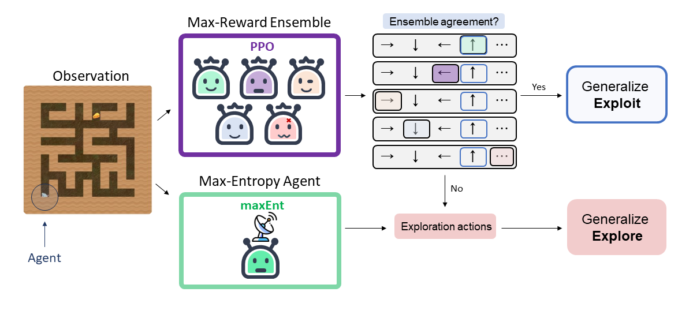
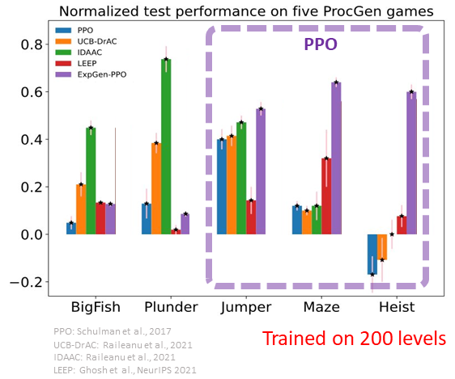
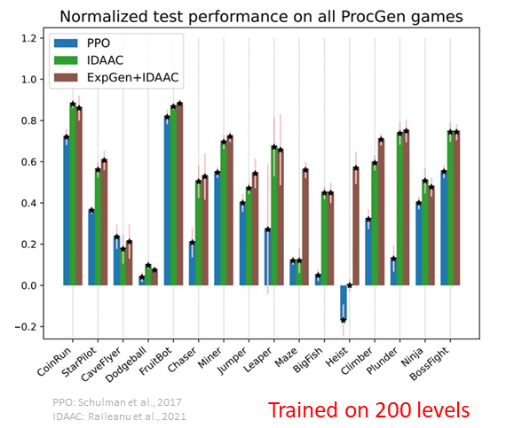

# ExpGen: Explore to Generalize in Zero-Shot RL

PyTorch implementation of ExpGen [[Paper]](https://arxiv.org/abs/2306.03072) (NeurIPS'23).



# Citation

Please cite using the following entry (bibtex):

```
@article{zisselman2023explore,
  title={Explore to Generalize in Zero-Shot RL},
  author={Zisselman, Ev and Lavie, Itai and Soudry, Daniel and Tamar, Aviv},
  journal={arXiv preprint arXiv:2306.03072},
  year={2023}
}
```

## Installation

Recommended setup:

- Ubuntu +18.4
- Python +3.7

Clone repo and install dependencies:

```
git clone https://github.com/EvZissel/expgen.git
cd expgen

conda env create -f environment.yml
conda activate expgen_env

pip install procgen
```

# Example: Train ExpGen on ProcGen Maze
Example of training ExpGen on [ProcGen environments](https://openai.com/blog/procgen-benchmark/):

## Train a reward maximizing agent 
Use a range of different seed values to produce an ensemble of agents:
```
python train_ppo.py --env-name maze --seed 0 
```
Note: Use seed values 0-9 to reproduce the results presented in the paper.

## Train a maxEnt agent
```
python train_maxEnt.py --env-name maze
```
## Evaluate ExpGen
```
python expgen_ensemble.py --env-name maze
```

Note: The hyperparameters used in the paper are set as default values in code.


# ProcGen Results 
Using PPO ensemble, **ExpGen** demonstrates a notable performance gain on games that were not solvable using invariant based approaches.



Alternatively, **ExpGen** can also utilize invariance based approaches such as an ensemble of [IDAAC](https://arxiv.org/abs/2102.10330) agents (instead of PPO) to attain invariance and test time exploration, achieving state-of-the-art results.



### Acknowledgements
This code is based on the open-source PyTorch implementation of [PPO](https://github.com/ikostrikov/pytorch-a2c-ppo-acktr-gail).

